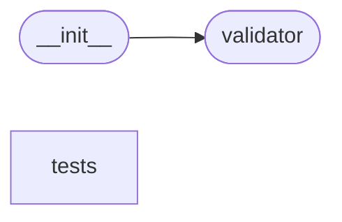

# Code Overview

[_Documentation generated by Documatic_](https://www.documatic.com)

<!---Documatic-section-Codebase Structure Python-start--->
## Codebase Structure Python

The codebase has a single-depth folder structure,
                with 13 code files in total.

<!---Documatic-block-system_architecture-start--->

<!---Documatic-block-system_architecture-end--->

# #
<!---Documatic-section-Codebase Structure Python-end--->

<!---Documatic-section-Key Objects-start--->
## Key Objects

There are exposed imports at level-0
from the source directory (validictory)

<!---Documatic-block-validictory-start--->

	
<code>validictory</code> (Click to Expand!)

* `validictory.validator.FieldValidationError`
* `validictory.validator.MultipleValidationError`
* `validictory.validator.SchemaError`
* `validictory.validator.SchemaValidator`
* `validictory.validator.ValidationError`

<!---Documatic-block-validictory-end--->

# #
<!---Documatic-section-Key Objects-end--->

<!---Documatic-section-Important Functions-start--->
## Important Functions

<!---Documatic-block-important_funcs-start--->
<!---Documatic-block-end_user_funcs-start--->
### End User Exposed Functions

* [validictory.validator.FieldValidationError](3-validictory_validator.md#validictory.validator.FieldValidationError)
* [validictory.validator.ValidationError](3-validictory_validator.md#validictory.validator.ValidationError)
* [validictory.validator.SchemaValidator](3-validictory_validator.md#validictory.validator.SchemaValidator)
* [validictory.validator.MultipleValidationError](3-validictory_validator.md#validictory.validator.MultipleValidationError)
* [validictory.validator.SchemaError](3-validictory_validator.md#validictory.validator.SchemaError)
* validictory.__init__.validate
<!---Documatic-block-end_user_funcs-end--->
<!---Documatic-block-important_funcs-end--->

# #
<!---Documatic-section-Important Functions-end--->

<!---Documatic-section-File IO-start--->
## File IO

<!---Documatic-block-file_io-start--->
The following files have file read operations

<!---Documatic-block-validictory-start--->

	
<code>validictory</code> (Click to Expand!)

* validictory.__init__

<!---Documatic-block-validictory-end--->
<!---Documatic-block-file_io-end--->

# #
<!---Documatic-section-File IO-end--->

<!---Documatic-section-Class Hierarchy-start--->
## Class Hierarchy

<!---Documatic-block-TestCase-start--->

	
<code>TestCase</code> (Click to Expand!)

* validictory.tests.test_fail_fast.TestFailFast
* validictory.tests.test_items.TestAdditionalItems
* validictory.tests.test_items.TestItems

<!---Documatic-block-TestCase-end--->

<!---Documatic-block-ValueError-start--->

	
<code>ValueError</code> (Click to Expand!)

* [validictory.validator.SchemaError](3-validictory_validator.md#validictory.validator.SchemaError)
* [validictory.validator.ValidationError](3-validictory_validator.md#validictory.validator.ValidationError)

<!---Documatic-block-ValueError-end--->

<!---Documatic-block-object-start--->

	
<code>object</code> (Click to Expand!)

* [validictory.validator.SchemaValidator](3-validictory_validator.md#validictory.validator.SchemaValidator)

<!---Documatic-block-object-end--->

<!---Documatic-block-validictory.validator.SchemaValidator-start--->

	
<code>validictory.validator.SchemaValidator</code> (Click to Expand!)

* validictory.tests.test_type.DateValidator

<!---Documatic-block-validictory.validator.SchemaValidator-end--->

<!---Documatic-block-validictory.validator.ValidationError-start--->

	
<code>validictory.validator.ValidationError</code> (Click to Expand!)

* validictory.validator.DependencyValidationError
* [validictory.validator.FieldValidationError](3-validictory_validator.md#validictory.validator.FieldValidationError)
* [validictory.validator.MultipleValidationError](3-validictory_validator.md#validictory.validator.MultipleValidationError)
* validictory.validator.RequiredFieldValidationError

<!---Documatic-block-validictory.validator.ValidationError-end--->

# #
<!---Documatic-section-Class Hierarchy-end--->

[_Documentation generated by Documatic_](https://www.documatic.com)