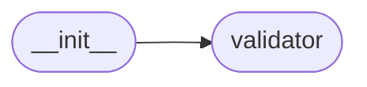

# Validictory Init

[_Documentation generated by Documatic_](https://www.documatic.com)

<!---Documatic-section-Codebase Structure-start--->
## Codebase Structure

<!---Documatic-block-system_architecture-start--->

<!---Documatic-block-system_architecture-end--->

# #
<!---Documatic-section-Codebase Structure-end--->

<!---Documatic-section-validictory.__init__.validate-start--->
## validictory.__init__.validate

<!---Documatic-section-validate-start--->
<!---Documatic-block-validictory.__init__.validate-start--->
<details>
	<summary><code>validictory.__init__.validate</code> code snippet</summary>

```python
def validate(data, schema, validator_cls=SchemaValidator, format_validators=None, required_by_default=True, blank_by_default=False, disallow_unknown_properties=False, apply_default_to_data=False, fail_fast=True, remove_unknown_properties=False):
    v = validator_cls(format_validators, required_by_default, blank_by_default, disallow_unknown_properties, apply_default_to_data, fail_fast, remove_unknown_properties)
    return v.validate(data, schema)
```
</details>
<!---Documatic-block-validictory.__init__.validate-end--->
<!---Documatic-section-validate-end--->

# #
<!---Documatic-section-validictory.__init__.validate-end--->

[_Documentation generated by Documatic_](https://www.documatic.com)